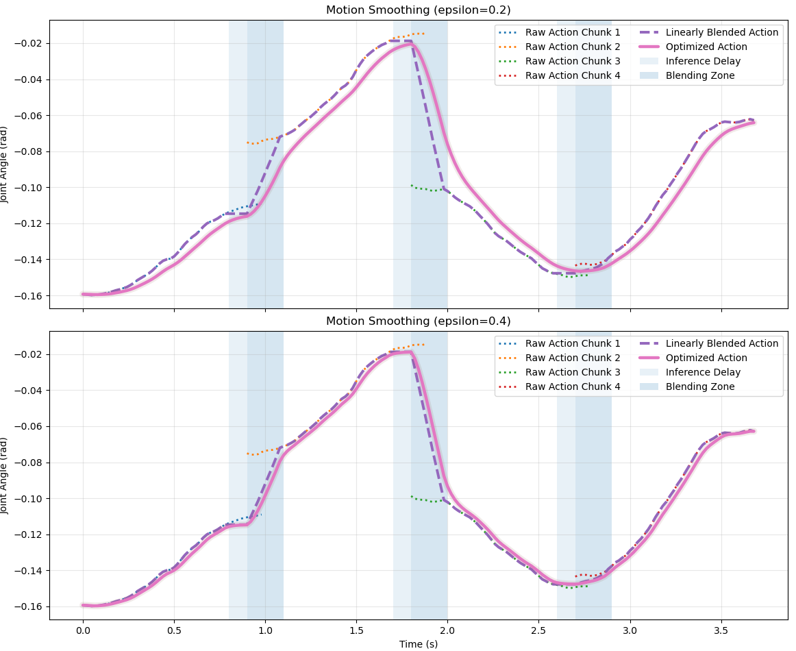

# Motion-Smoothing-for-VLA-DP

Aiming to reduce inference latency and smooth executed actions in VLA and Diffusion based planning.

## Setup

- Old chunk:  
  $$\mathbf{a}^{old} = \{a^{old}_0, \dots, a^{old}_{T-1}\}$$

- New chunk:  
  $$\mathbf{a}^{new} = \{a^{new}_0, \dots, a^{new}_{T-1}\}$$

- Inference delay: $d$ steps  
- Blending window: $L$ steps  

---

## 1. Time Alignment (due to delay)

At blending start, new chunk is already at:

$$
a^{new}_{d}
$$

So aligned segment:

$$
a^{new}_{d + k}, \quad k = 0, \dots, L-1
$$

---

## 2. Linear Blending (Chunk Boundary)

$$
\tilde{a}_{T-L+k}
=
(1 - \alpha_k)\, a^{old}_{T-L+k}
+
\alpha_k\, a^{new}_{d + k}
$$

$$
\alpha_k = \frac{k+1}{L}
$$

**Interpretation:** smooth transition from old → new chunk.

---

## 3. Inference Delay (Hold)

$$
a_t = a^{old}_{T-L}, \quad t \in [t_0, t_0 + d)
$$

**Interpretation:** system executes last known command while waiting.

---

## 4. Stitched Action

$$
\tilde{a}_t =
\begin{cases}
a^{old}_t, & t < T-L \\
a^{old}_{T-L}, & t \in \text{delay} \\
(1-\alpha)a^{old} + \alpha a^{new}, & t \in \text{blend} \\
a^{new}_{d + k}, & \text{after blend}
\end{cases}
$$

---

## 5. EMA Smoothing (Final Action)

$$
a_t = (1 - \epsilon)\, a_{t-1} + \epsilon\, \tilde{a}_t
$$

**Interpretation:** smooth temporal evolution (low-pass filter).

---

## 6. Expanded EMA

$$
a_t =
\epsilon \tilde{a}_t
+
\epsilon(1-\epsilon)\tilde{a}_{t-1}
+
\epsilon(1-\epsilon)^2 \tilde{a}_{t-2}
+ \cdots
$$

**Interpretation:** weighted average over past actions.

---

## 7. Closed-form (constant target)

If $\tilde{a}_t = a^*$:

$$
a_t = a^* + (a_0 - a^*)(1-\epsilon)^t
$$

**Interpretation:** exponential convergence.

---

## 8. Summary

- **Blending ($\alpha$):** removes chunk discontinuity  
- **Delay ($d$):** models system latency  
- **EMA ($\epsilon$):** reduces jitter  

$$
\text{Old} \rightarrow \text{Delay} \rightarrow \text{Blend} \rightarrow \text{EMA} \rightarrow \text{Final}
$$

---

## 9. Constraint

$$
d + L \leq T
$$

---

## Intuition (1-line)

- **$\alpha$ → where to go**  
- **$\epsilon$ → how fast to go**